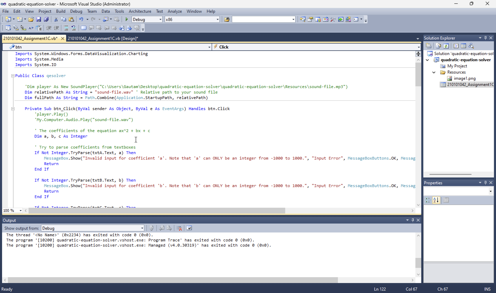
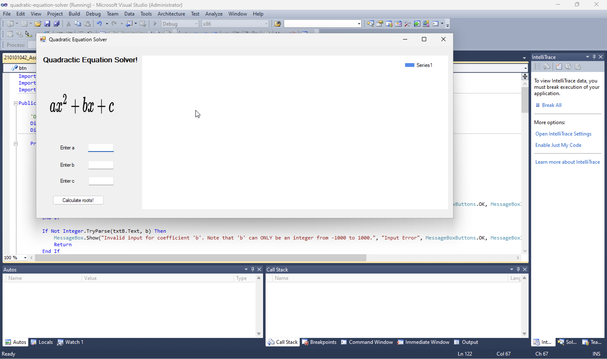

# CS346: Software Engineering Laboratory

## Assignment-1

### Implementing a Quadratic Equation Solver in Visual Basic

Folder Structure

```
210101042_Assignment1C
|- README.md
|- assets/
    | - image.png
    | - image1.png
|- quadratic-equation-solver/
    | - quadratic-equation-solver.sln
    | - quadratic-equation-solver.suo
    | - quadratic-equation-solver/
        | - bin/ (has the sound files)
        | - My Project/
        | - obj/
        | - Resources/
        | - 210101042_Assignment1C.Designer.vb
        | - 210101042_Assignment1C.resx
        | - 210101042_Assignment1C.vb (run this)
        | - App.config
        | - quadratic-equation-solver.vbproj
```

## File Structure

I have written my code in `Visual Basic`, as instructed by sir, and hence submitted a project named `quadratic-equation-solver` with a `.vb` file, named `210101042_Assignment1C.vb`.

To find the required files, one needs to open the `quadratic-equation-solver` folder, which contains another folder named `quadratic-equation-solver`, this folder is our `solution` and contains `210101042_Assignment1C.vb`.

## Running the program

Opening the project in `Visual Studio 2010` renders this:



Fig. 1: Visual Studio 2010

One needs to click the green button on the left of the `Debug` dropdown list in order to build and run the solution.



Fig. 2: The program starts on clicking the green button on the left of the `Debug` dropdown list.

## Input structure

1. `a`, `b`, `c` should be `INTEGERS` ranging from `-1000` to `1000` both sides INCLUSIVE.
2. `a` can't be zero.

Click on `Calculate roots` button to actually calculate the roots of the quadratic equation solver.

## Output structure

The output consists of:

1. Whether the equation has real roots or not.
2. The roots of the equation correct upto **three decimal places** if the equation has real roots.
3. A message showing the calculation using `complete the square method` for solving the quadratic equation.
4. Zoomable graph of the function.
5. Appropriate Music